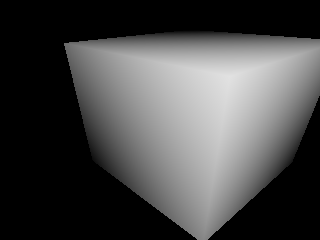

## About
point_cloud_utils is a CUDA non-differentiable mesh rasterization library for pytorch tensors with python bindings. 

CUDA point cloud utils support: 
- loader (all using pinhole camera):
  - create point cloud (vertices, vertice values) from depth and values images 
  - create mesh (vertices, faces, vertice values)  from depth and values images
- transformer
  - apply rotation and translation to vertices
- rasterizer (all using pinhole camera): 
  - mesh z filter (not yet converted to precision problem-less version)
  - estimate normals
  - project mesh
  - project point cloud to 2d (TODO: remove z-fighting) 
  - project point cloud to 3d
  
## Example

[Visualize z buffer and normals of cube](./example/cube.py):
```python
import point_cloud_utils
import torch
import cv2
import numpy as np

dtype = torch.float32
device = torch.device('cuda:0')

vertices = torch.tensor([
        [0, 0, 0], [1, 0, 0], [1, 1, 0], [0, 1, 0],
        [0, 1, 1], [1, 1, 1], [1, 0, 1], [0, 0, 1]
    ], dtype=dtype, device=device)

faces = torch.tensor([
        [0, 2, 1], [0, 3, 2], [2, 3, 4], [2, 4, 5], [1, 2, 5], [1, 5, 6],
        [0, 7, 4], [0, 4, 3], [5, 4, 7], [5, 7, 6], [0, 6, 7], [0, 1, 6]
    ], dtype=torch.int32, device=device)

R = torch.tensor(cv2.Rodrigues(np.array([0.5, 0.8, 0.2]))[0], dtype=dtype, device=device)
t = torch.tensor([-0.5, -0.5, 1.3], dtype=dtype, device=device)
vertices = vertices @ R.T + t

pinhole2d = point_cloud_utils.Pinhole2D(
    fx=200, fy=200,
    cx=160, cy=120,
    w=320, h=240,
)

z_buffer = point_cloud_utils.project_mesh(
    vertices=vertices,
    faces=faces,
    vertice_values=vertices[:, [2]],  # take z coordinate as values
    pinhole=pinhole2d
)
vis_z_buffer_cpu = point_cloud_utils.vis_z_buffer(z_buffer)
cv2.imwrite(f'./depth.png', vis_z_buffer_cpu)


coords, normals = point_cloud_utils.estimate_normals(
    vertices=vertices,
    faces=faces,
    pinhole=pinhole2d
)
vis_normals_cpu = point_cloud_utils.vis_normals(coords, normals)
cv2.imwrite(f'./normals.png', vis_normals_cpu)
``` 
Will produce:




## Install
- on desktop: `./setup.sh`
- on Moscow LSF-cluster: 
  - make sure you have pytorch installed with cudatoolkit=9.2
  - go to any GPU-node
  - `scl enable devtoolset-7 'TORCH_CUDA_ARCH_LIST="Pascal" bash setup.sh'` 


## Possible installation errors
- `packedpacked_accessor32` in error msgs means you have pytorch version < 1.3
- errors caused by pytorch internal header files could mean that you have pytorch cuda version and host cuda version mismatch, try reinstalling pytorch     

## Misc
- tested till pytorch 1.6;
- torch.float32 or torch.float64 dtypes are supported, torch.float16 is not;
- To build for custom cuda arches paste to rc file: 
`export TORCH_CUDA_ARCH_LIST="Pascal Turing"`.
This env variable is used [here](https://github.com/pytorch/pytorch/blob/5710374e4e335c6761d2b8b937a2b54a5577cb5d/torch/utils/cpp_extension.py#L1298).

## Known issues
- [FIXED] precision problems could show up when operating on far-away points or high resolution: points will dissapear